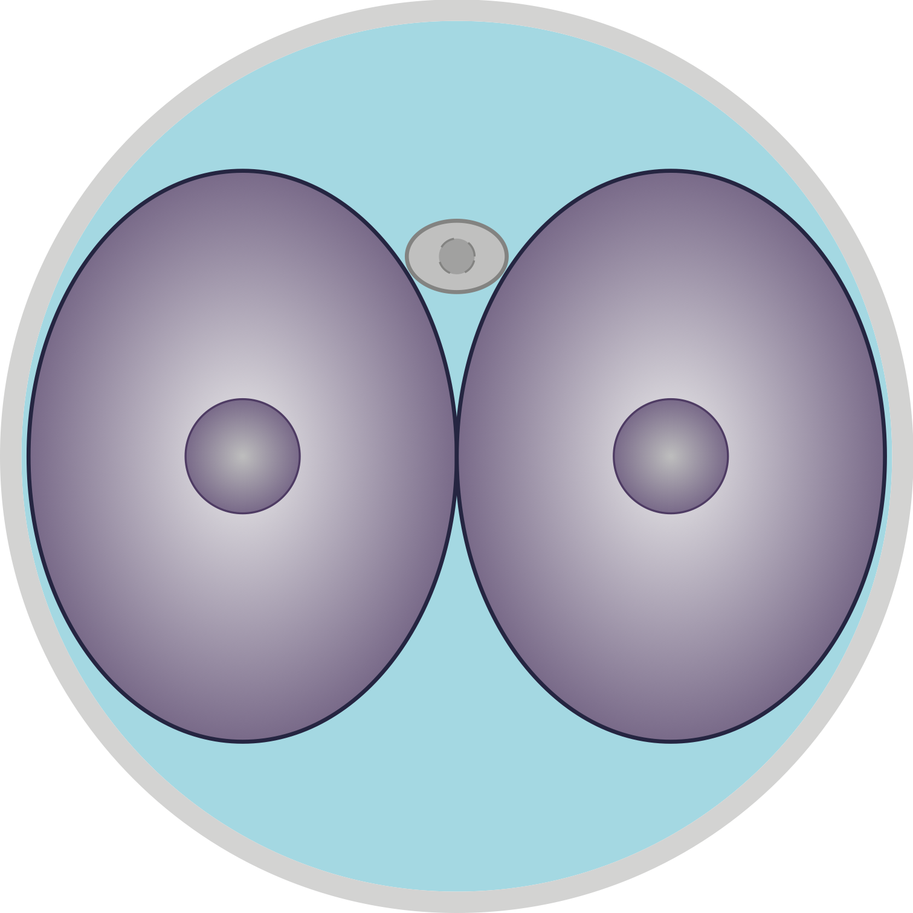
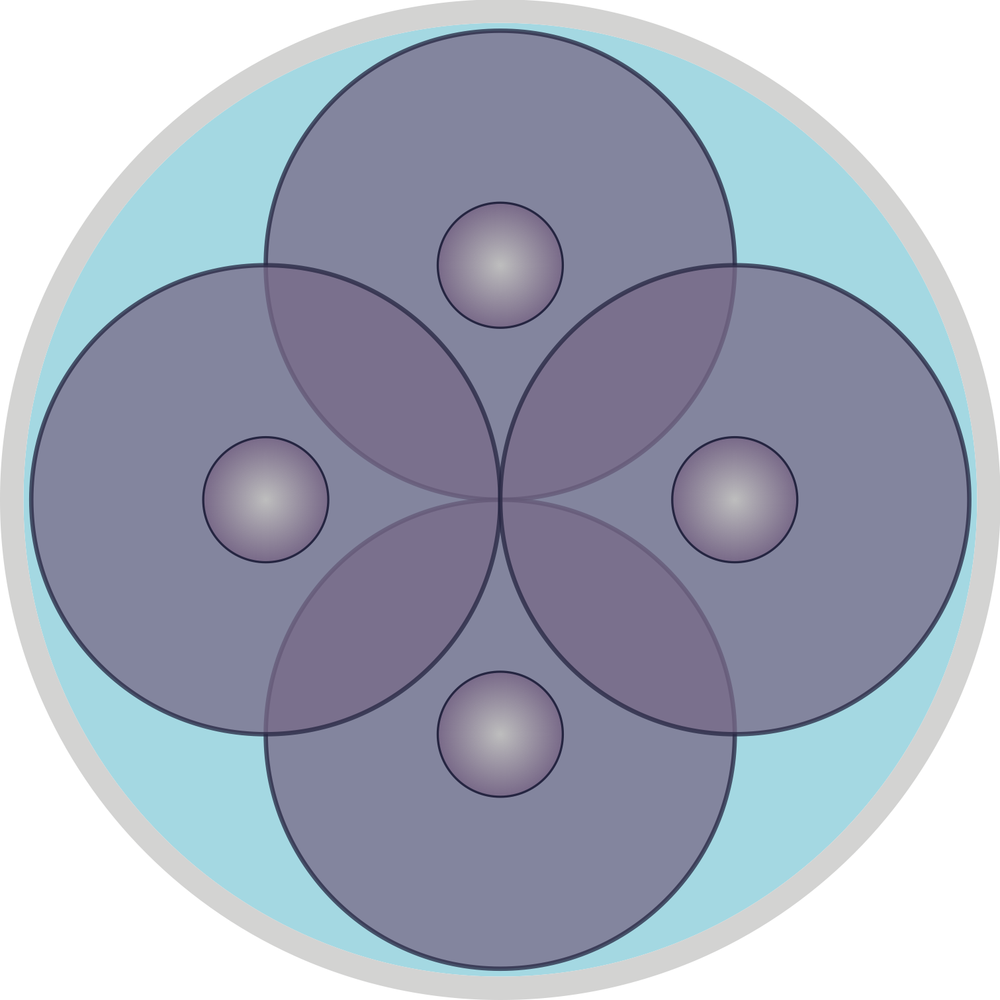

# Mouse Embryo Development

Schematic view of different stages of mouse embryo development.

I hope they are scientifically accurate enough.

## MII Oocyte

## Sperm

## Zygote (PN4)

## 2-Cell Embryo

## 4-Cell Embryo, Style 1

## 4-Cell Embryo, Style 2

## 8-Cell Embryo

## Morula Embryo

## Early Blastocyst

## Late Blastocyst

